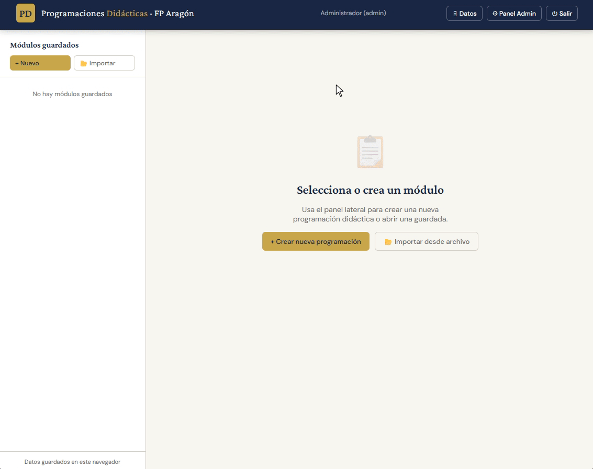

# 📋 Programaciones Didácticas FP — Aragón

Herramienta web multiusuario para que los docentes de **Formación Profesional** creen, gestionen y exporten sus **programaciones didácticas**, con importación automática de datos desde [CATEDU](https://centrosdocentes.catedu.es) y control centralizado de contenidos por parte del equipo directivo o jefatura de departamento.

> Desarrollada específicamente para el sistema educativo de **Aragón**, con integración directa en el portal de centros docentes de CATEDU y adaptada a la normativa vigente (ORDEN ECD/842/2024 y concordantes).

---

## ✨ Algunas caracterísicas

### Crear PERFILES


### Crear USUARIOS


### BLOQUEAR campos


### CREAR PROGRAMACIONES


---

## ✨ Características principales

### Para el docente
- **Crear programaciones didácticas** por módulo con todos los apartados reglamentarios:
  - a) Introducción y contextualización
  - b) Resultados de aprendizaje y criterios de evaluación
  - c) Secuenciación y unidades didácticas
  - d) Metodología y orientaciones pedagógicas
  - e) Evaluación (instrumentos, criterios de calificación, pérdida de evaluación continua)
  - f) Atención a la diversidad
  - g) Recursos y materiales
  - h) Actividades complementarias
- **Importación automática desde CATEDU** al crear una programación — navega por Familia Profesional → Ciclo Formativo → Módulo y la herramienta rellena automáticamente:
  - Denominación y código del módulo
  - Horas semanales y horas totales del curso
  - Ciclo formativo completo
  - Resultados de Aprendizaje (RAs)
  - Criterios de Evaluación (CEs) codificados (CE1.a, CE1.b…)
- **Importar RAs y CEs desde CATEDU** también en cualquier momento desde una programación ya creada
- **Exportar a PDF y Word** la programación terminada
- **Ver en modo solo lectura** las programaciones de compañeros del mismo ciclo
- **Editor de texto enriquecido** (negrita, cursiva, listas, checklists) en los campos de desarrollo libre
- **Guardado automático** con debounce — los cambios se guardan solos 1,5 s después de cada edición
- Menú **🗄 Datos** para exportar/importar copias de seguridad en JSON

### Para el administrador
- **Panel de administración** con tres pestañas:
  - 👨‍🏫 **Docentes y seguridad** — crear, editar (nombre, ciclo, contraseña), activar/desactivar y eliminar cuentas de docentes; cambiar la contraseña del admin
  - 🔄 **Perfiles de ciclo** — crear un perfil por ciclo formativo (IFC201, FPB121, etc.); ver cuántos campos tiene bloqueados cada perfil con acceso directo a editarlos
  - 🔒 **Campos bloqueados** — seleccionar un ciclo y activar el candado en cualquier campo para fijar su contenido: los docentes lo verán pero no podrán modificarlo
- Cada **perfil de ciclo** tiene sus propios campos bloqueados con sus propios valores — distintos entre ciclos
- Los campos bloqueados se aplican automáticamente y el backend los impone aunque el cliente intente enviar otro valor
- El administrador puede ver y editar **todas** las programaciones de todos los docentes

---

## 🏗 Arquitectura

```
programaciones-fp/
├── docker-compose.yml          # Orquestación: backend + frontend (Nginx)
├── backend/
│   ├── Dockerfile
│   ├── server.js               # API REST con Express.js
│   ├── db.js                   # SQLite con better-sqlite3 (tablas + admin inicial)
│   ├── middleware/
│   │   └── auth.js             # JWT en cookie httpOnly (requireAuth / requireAdmin)
│   └── routes/
│       ├── auth.js             # POST /login · POST /logout · GET /me
│       ├── users.js            # CRUD docentes (solo admin)
│       ├── profiles.js         # CRUD perfiles de ciclo y locked_fields
│       └── modules.js          # CRUD programaciones con control de permisos
├── frontend/
│   ├── Dockerfile
│   ├── nginx.conf              # Proxy /api/* → backend; estáticos → HTML
│   └── index.html              # SPA completa en un único fichero HTML
└── data/
    └── .gitkeep                # Directorio de la BD (db.sqlite se genera al arrancar)
```

**Stack:** Node.js 20 · Express · SQLite (better-sqlite3) · Nginx Alpine · Docker

---

## 🚀 Instalación y arranque

### Requisitos
- [Docker Desktop](https://www.docker.com/products/docker-desktop/) (Windows / macOS)
- Docker Engine + Compose plugin (Linux)

### Primer arranque

```bash
# 1. Clonar el repositorio
git clone https://github.com/tu-usuario/programaciones-fp.git
cd programaciones-fp

# 2. (Recomendado) Cambiar contraseña y secreto JWT antes de arrancar
#    Edita docker-compose.yml y modifica las variables de entorno

# 3. Construir imágenes y arrancar en segundo plano
docker-compose up -d --build
```

La aplicación queda disponible en **http://localhost:3000**

> La base de datos se crea automáticamente en `./data/db.sqlite` con el usuario admin en el primer arranque.

### Arranques posteriores

```bash
docker-compose up -d
```

---

## 🔐 Credenciales iniciales

| Usuario | Contraseña |
|---------|------------|
| `admin` | `admin1234` |

> ⚠️ **Cambia la contraseña del admin** en el Panel de Administración → pestaña *👨‍🏫 Docentes y seguridad* tras el primer login.

Para establecer credenciales propias **antes del primer arranque**, edita `docker-compose.yml`:

```yaml
environment:
  - ADMIN_PASSWORD=contraseña_segura_aqui
  - JWT_SECRET=cadena_larga_y_aleatoria_aqui
```

---

## 👣 Flujo de uso recomendado

### 1. Configuración inicial (admin)

1. Entra en **http://localhost:3000** con `admin / admin1234`
2. Abre el **Panel de administración** (botón ⚙ arriba a la derecha)
3. Pestaña **🔄 Perfiles de ciclo** → crea un perfil por cada ciclo del centro  
   Ej: `IFC201 — Sistemas Microinformáticos y Redes`
4. Pestaña **🔒 Campos bloqueados** → selecciona el ciclo, activa el candado en los campos que deben ser comunes (RD del título, normativa de Aragón, datos del centro…) y escribe el texto fijo
5. Pestaña **👨‍🏫 Docentes** → crea las cuentas de cada docente y asígnales su ciclo
6. Pulsa **💾 Guardar configuración** para aplicar

### 2. Crear una programación (docente)

1. Inicia sesión con las credenciales facilitadas por el admin
2. En el panel lateral, pulsa **+ Crear nueva programación**
3. Pulsa **🔍 Buscar módulo** para importar desde CATEDU:
   - Selecciona Familia Profesional → Ciclo Formativo → Módulo
   - Pulsa **⬇ Cargar RAs desde CATEDU** (opcional — importa RAs y CEs)
   - Pulsa **✔ Rellenar datos** — se autocompletan nombre, código, horas, ciclo y, si los cargaste, RAs y CEs
4. Introduce el **curso académico** y pulsa **Crear módulo**
5. Completa los apartados restantes del formulario (los cambios se guardan automáticamente)
6. Exporta a **📥 PDF** o **📄 Word** cuando la programación esté terminada

### 3. Importar RAs en una programación existente

Desde cualquier programación ya creada, en las secciones **b) Resultados de aprendizaje** o **Criterios de evaluación** aparece el botón **📥 Importar desde CATEDU** para actualizar esos campos en cualquier momento.

---

## 🔒 Permisos

| Acción | Admin | Docente (propio ciclo) | Docente (otro ciclo) |
|--------|:-----:|:----------------------:|:--------------------:|
| Ver sus propias programaciones | ✅ | ✅ | ✅ |
| Editar sus propias programaciones | ✅ | ✅ | ❌ |
| Ver programaciones del mismo ciclo | ✅ | 👁 solo lectura | ❌ |
| Editar programaciones de otros | ✅ | ❌ | ❌ |
| Gestionar docentes y perfiles | ✅ | ❌ | ❌ |
| Bloquear campos por ciclo | ✅ | ❌ | ❌ |

---

## 🌐 Importación desde CATEDU

La herramienta se conecta en tiempo real al portal [centrosdocentes.catedu.es](https://centrosdocentes.catedu.es) para importar:

- El catálogo de **Familias Profesionales** con sus **Ciclos Formativos**
- Los **módulos** de cada ciclo: código, nombre, horas semanales y horas totales
- Los **Resultados de Aprendizaje (RAs)** y sus **Criterios de Evaluación (CEs)** oficiales, codificados automáticamente

> **Nota CORS:** al ser una petición cross-origin desde el navegador, la importación usa proxies CORS públicos como fallback. Si los proxies están lentos o caídos, puedes instalar una extensión de navegador tipo *CORS Unblock* para que la petición vaya directa.

---

## 💾 Copia de seguridad

Los datos se guardan en `./data/db.sqlite` (volumen Docker, fuera del contenedor). Para hacer una copia manual:

```bash
# Crear directorio de backups si no existe
mkdir -p backups

# Copiar la BD con marca de fecha y hora
cp data/db.sqlite backups/db_$(date +%Y%m%d_%H%M).sqlite
```

Desde la propia aplicación también puedes usar el menú **🗄 Datos → 📦 Exportar copia de seguridad (.json)** para descargar un JSON portable con todas las programaciones.

---

## 🛠 Comandos útiles

```bash
# Ver logs en tiempo real (todos los servicios)
docker-compose logs -f

# Solo logs del backend
docker-compose logs -f backend

# Parar los contenedores sin borrar datos
docker-compose down

# Parar y eliminar imágenes (los datos en ./data persisten)
docker-compose down --rmi all

# Actualizar solo el frontend sin rebuild completo
docker cp frontend/index.html pd_frontend:/usr/share/nginx/html/index.html

# Entrar al contenedor del backend para depuración
docker exec -it pd_backend sh
```

---

## 📄 Licencia

MIT — libre para uso, modificación y distribución.